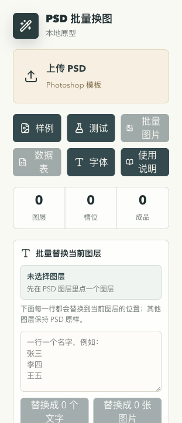
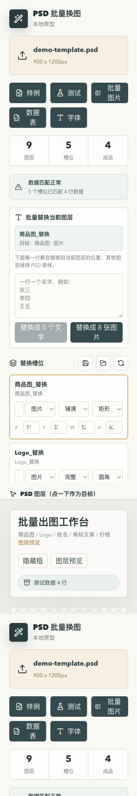
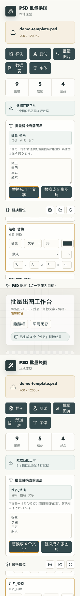
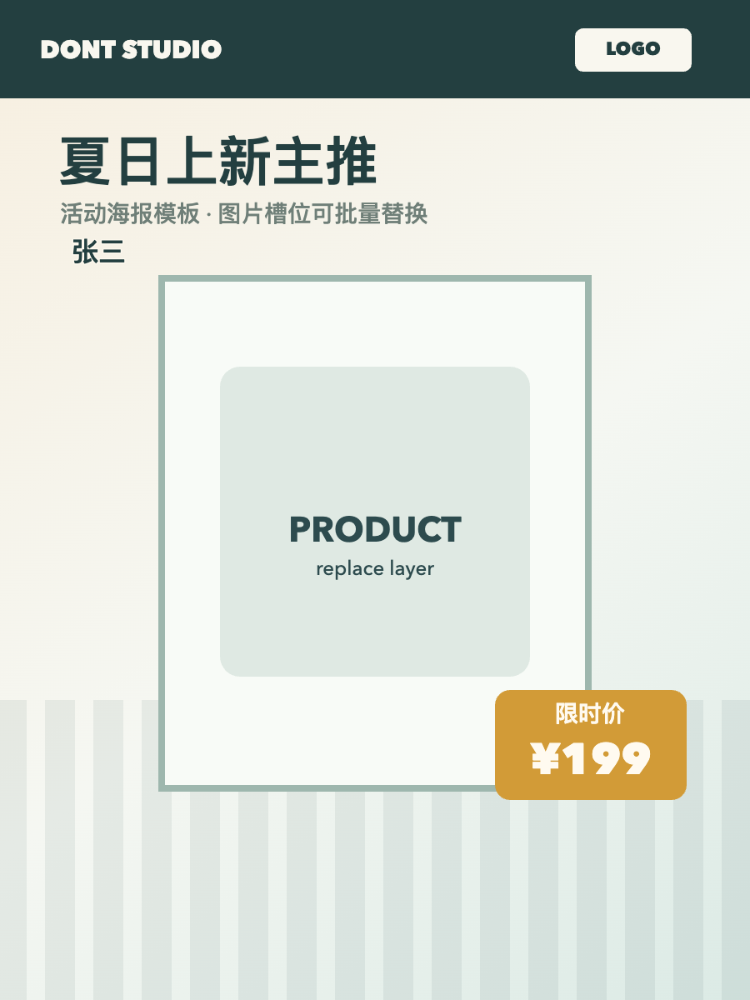
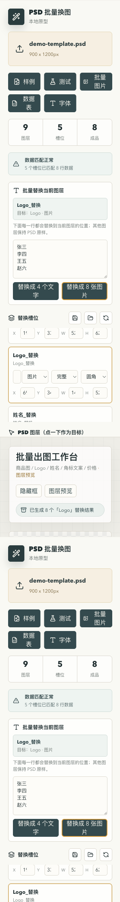
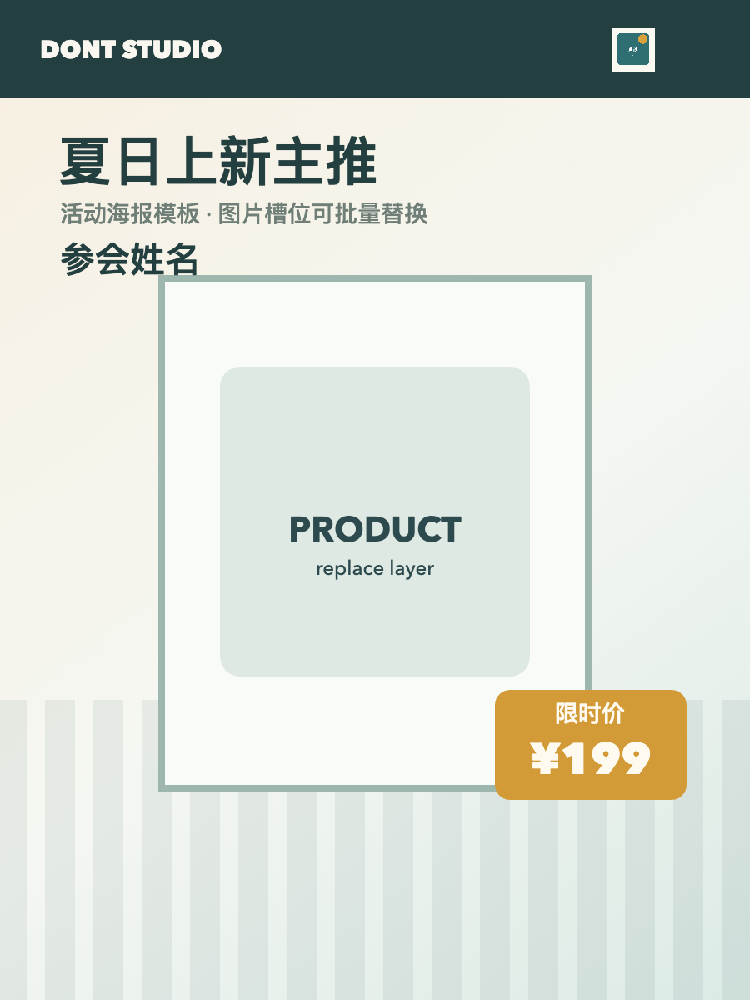

# PSD 批量换图工作台使用说明

这份文档给第一次使用工具的设计师和运营同学看。你不需要会写代码，只需要会准备 PSD、图片素材和名单/表格。

工具地址：

- 线上体验版：https://siuserxiaowei.github.io/psd-batch-tool/
- 本地开发版：http://127.0.0.1:5174/

## 这个工具解决什么问题

当你有一张 PSD 海报模板，大部分内容不变，只想批量替换一小部分内容时，可以用这个工具。

常见场景：

- 给 20 位嘉宾生成 20 张参会卡片，每张只换姓名和头像。
- 给 10 个商品生成 10 张海报，每张只换商品图、价格和标签。
- 给一批课程/活动图批量替换 Logo、二维码、人物图。

核心逻辑很简单：

1. 上传 PSD。
2. 选中要替换的图层。
3. 输入一批名字，或上传一批图片。
4. 工具自动生成多张 PNG。
5. 确认无误后导出压缩包。

## 界面长什么样

打开后会看到左侧操作区和右侧预览区。



左侧主要区域：

- 上传 PSD：导入 Photoshop 模板。
- 样例：载入一张简单模板，适合先熟悉界面。
- 测试：载入模板、图片和表格数据，一键看完整流程。
- 批量图片：上传头像、Logo、商品图等图片素材。
- 数据表：上传 CSV 或 Excel 表格。
- 字体：上传设计用字体。
- 使用说明：打开这份操作文档。
- 批量替换当前图层：临时输入一批名字，快速替换当前选中的图层。
- 替换槽位：管理哪些图层可以被替换。
- PSD 图层：从 PSD 里选择目标图层。

右侧主要区域：

- 预览画布：查看当前生成结果。
- 黄色/红色框：可替换图层的位置提示。
- 批量结果：展示生成出来的多张图片。
- 导出 PNG 包：导出全部成品。

## 先用测试数据跑一遍

第一次使用建议先点「测试」。

点完后，工具会自动载入一张样例 PSD、几张图片和几行数据。你可以看到右侧已经生成了预览和批量结果。



如果看到「数据匹配正常」，说明图片和表格字段都能匹配上。

## 最快方式：批量替换一组名字

适合场景：参会卡、证书、头像卡、邀请函，只需要把一个文字图层换成不同名字。

操作步骤：

1. 上传 PSD，或先点「样例」。
2. 在左侧「PSD 图层」或「替换槽位」里点选要替换的文字图层，例如「姓名」。
3. 在「批量替换当前图层」输入名字，一行一个。
4. 点击「替换成 N 个文字」。
5. 在右侧「批量结果」查看生成的每一张。
6. 确认无误后点「导出 PNG 包」。

示例输入：

```text
张三
李四
王五
赵六
```

生成后界面会显示 4 张结果。



生成效果示例：



## 批量替换头像、Logo、商品图

适合场景：每张海报换一个头像、一个 Logo、一个商品图或一个二维码。

操作步骤：

1. 上传 PSD。
2. 点击「批量图片」，上传所有要替换进去的图片。
3. 在「PSD 图层」或「替换槽位」里点选目标图层，例如「头像」或「Logo」。
4. 确认槽位类型是「图片」。
5. 根据需要选择图片模式：
   - 铺满：填满整个框，可能会裁切图片。
   - 完整：完整显示图片，不裁切，可能留边。
   - 拉伸：强行拉到框的尺寸，可能变形。
6. 根据需要选择裁切形状：
   - 矩形：适合商品图、二维码。
   - 圆角：适合 Logo、卡片。
   - 圆形：适合头像。
7. 点击「替换成 N 张图片」。
8. 在右侧查看全部生成结果。



生成效果示例：



## 用表格一次替换多个元素

如果一张海报里同时要换姓名、头像、价格、Logo，建议用表格。

表格列名要和「替换槽位」里的别名一致。例如槽位叫：

- 姓名
- 头像
- Logo
- 价格

那么表格可以这样写：

```csv
页面名称,姓名,头像,Logo,价格
张三海报,张三,zhangsan.png,logo-a.png,¥199
李四海报,李四,lisi.png,logo-b.png,¥299
王五海报,王五,wangwu.png,logo-c.png,¥399
```

使用步骤：

1. 先上传 PSD。
2. 上传头像、Logo、商品图等图片素材。
3. 点「数据表」，上传 CSV 或 XLSX。
4. 看左侧的数据提醒：
   - 数据匹配正常：可以继续。
   - 找不到图片：检查图片文件名是否和表格一致。
   - 缺字段：检查表格列名是否和槽位别名一致。
5. 右侧翻页检查每一张。
6. 点击「导出 PNG 包」。

## 怎么选中正确图层

导入 PSD 后，左侧会显示「PSD 图层」。点击一个图层，它会进入「替换槽位」，并成为当前替换目标。

右侧预览区会出现框线：

- 黄色框：可替换图层。
- 红色框：当前选中的图层。
- 框里的文字：槽位名，生成后会显示当前行的值，例如 `姓名: 张三`。

如果框位置不准，可以在「替换槽位」里调整：

- X：左边距。
- Y：上边距。
- W：宽度。
- H：高度。

调完后右侧框会跟着变化。

## 保存和复用配置

同一张 PSD 调好槽位以后，可以点「保存当前 PSD 槽位配置」。

下次再上传同名同尺寸 PSD 时，工具会自动载入之前保存的配置，并补齐新识别到的图层。

如果你想重新让工具识别一遍，点「重选建议槽位」。

## PS 模板怎么准备更稳

建议设计师在 PSD 里把需要替换的内容单独放成图层，并命名清楚。

推荐命名：

```text
头像_替换
姓名_替换
Logo_替换
商品图_替换
价格_替换
二维码_替换
```

如果是价格牌这种结构，建议拆开：

```text
价格底框        固定不替换
角标文案_替换  表格里填「限时价」「新人价」等
价格_替换      表格里填「¥199」「¥299」等
```

尽量避免把要替换的内容藏在复杂组里。如果必须用组，也可以在工具里直接点具体子图层。

## 常见问题

### 1. 找不到我想替换的图层

先看左侧「PSD 图层」列表。现在工具会尽量把有尺寸的非组图层都列出来。

如果还是找不到：

- 检查这个内容在 PS 里是不是单独图层。
- 检查图层是不是隐藏了。
- 检查它是不是在很深的组里。
- 点「重选建议槽位」重新识别。

### 2. 右侧有框，但框里没有我要的内容

框只是告诉你“这个槽位在哪里”，不代表它一定已经有数据。

你需要：

- 文字替换：在输入框里输入名字，然后点「替换成 N 个文字」。
- 图片替换：先上传图片，再点「替换成 N 张图片」。
- 表格替换：上传表格，并确保列名和槽位别名一致。

### 3. 图片没有换上去

检查三件事：

- 是否已经上传图片。
- 当前选中的槽位类型是不是「图片」。
- 如果用表格，表格里的图片文件名是否和上传的图片文件名一致。

例如上传的是 `zhangsan.png`，表格里也要写 `zhangsan.png`，或者至少写 `zhangsan`。

### 4. 文字太大、太小或颜色不对

在「替换槽位」里找到该文字槽位，可以调：

- 字号。
- 文字颜色。
- 字体。
- 左对齐 / 居中 / 右对齐。

工具会自动缩小超出框的文字，但最好还是在这里手动调到接近设计稿效果。

### 5. PSD 预览和 Photoshop 里不完全一样

这是正常的。当前工具是网页原型，复杂智能对象、部分混合模式、复杂特效可能和 Photoshop 有差异。

建议：

- 关键可替换区域尽量用普通图层。
- 出图前多看右侧预览。
- 如果某个图层还原不准，可以把它在 PS 里提前栅格化后再导入。

## 推荐工作流

设计师：

1. 在 PS 里做模板。
2. 把要替换的内容单独命名。
3. 上传 PSD 到工具。
4. 调整槽位位置和类型。
5. 保存配置。

运营：

1. 准备图片素材。
2. 准备名单或表格。
3. 上传素材和表格。
4. 检查批量结果。
5. 导出 PNG 包。
